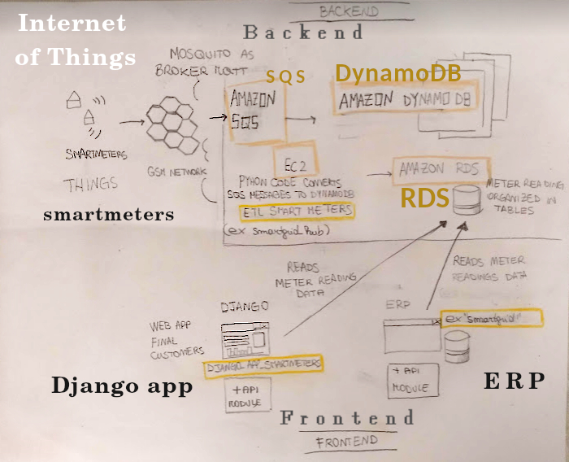

django app for clients smartmeters
======================================

### Old architecture
- Messages arrive from Smartmeters every15 minutes
- Throught mosquito they reach SQS Amazon
- Inside the same Server there are some python routines that  extract the payload of the messages
and put the into the DynamoDB table.
- Inside the same server there were other python routins that copied the content into relational MySQL database, diving messages my type of the table
- Using the "smartgrid" module inside the ERP, the content of the tables MySQL were read and made visible inside the ERP
- Using the module  "api" inside the module django_app_smart_meters the content of the tables MySQL were read and made visible inside the Frontend of the End Users 
and inside the Django admin backend.

(ERP = Enterprise Resource Planning - were used to manage Energy contracts.)
Very complicated !
I'm working on lighten this architecture, by removing redundant elements

